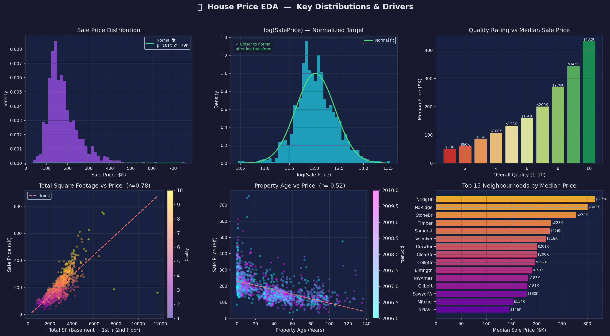
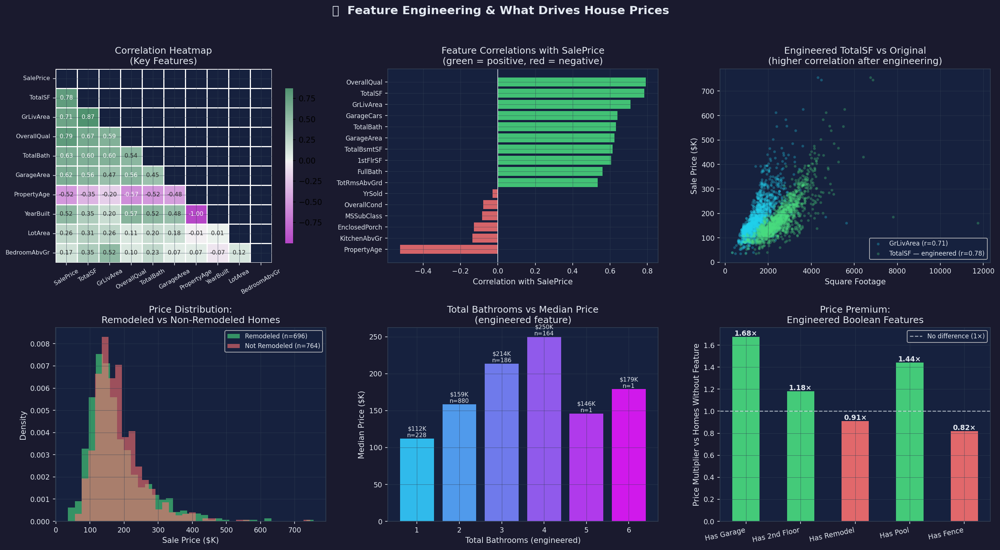
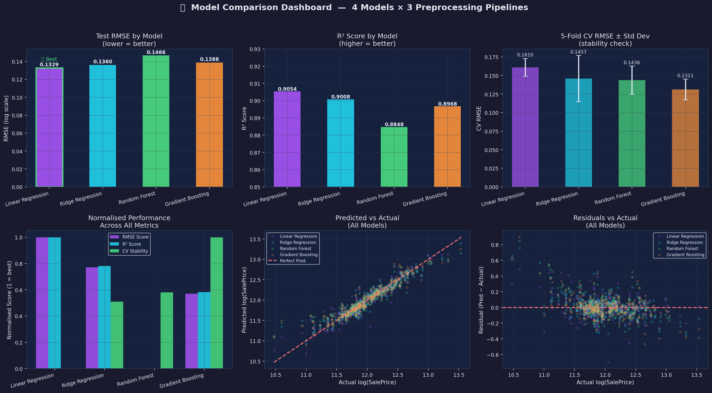
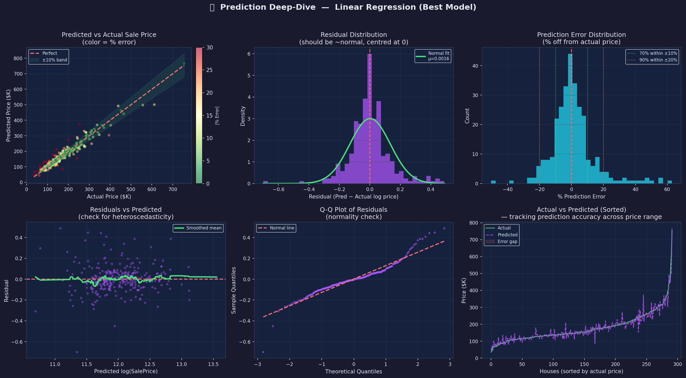

# 🏠 House Price Prediction
### Can a machine learning model predict what a house will sell for — and how close can it actually get?

This project answers that question end-to-end. Using real housing data from Ames, Iowa (1,460 homes), I built and compared four machine learning models to predict sale prices, then rigorously tested how accurate those predictions are in real dollar terms.

**The headline result: the best model predicts 70% of homes within ±10% of their actual sale price, and 90% within ±20% — using only the property's features, with no real estate expertise built in.**

---

## What Problem Does This Solve?

Accurate house price prediction has real business value. Lenders use it to assess collateral risk, real estate platforms use it to surface fair-value listings, and investors use it to identify underpriced properties. A model that can predict prices within ±10% is genuinely useful in those contexts — it reduces the reliance on manual appraisals and can process thousands of homes at once.

This project simulates that exact workflow: raw data in, price prediction out, with full transparency on where the model is confident and where it struggles.

---

## Tools Used


| Notebook | What's Inside |
|---|---|
| `House Price Predicion.ipynb` | Full model pipeline — data cleaning, feature engineering, model training & tuning |
| `House_Price_Visualizations.ipynb` | Standalone visual story — every chart and insight in one place |

---

## The Story in Four Acts

---

### Act 1 — What Does the Data Actually Look Like?



Before building any model, the first job is understanding the data. A few things stand out immediately.

**Sale prices are not evenly spread** — most homes sell between $100K–$250K, but a small number of luxury properties push all the way to $755K. That skew is a problem for machine learning models, which work best when the target variable follows a normal (bell-curve) distribution. The fix is a log-transformation: converting prices to their logarithm pulls the distribution into a normal shape. This is a standard technique in price modelling, and it meaningfully improves every model's performance.

**The strongest price drivers are clear from the data:**
- **Build quality (rated 1–10)** is the single most predictive feature. A quality-10 home has a median sale price of $432K — nearly 9× the $50K median for quality-1 homes. Every point on the scale translates to a meaningful price jump.
- **Total square footage** (basement + ground floor + upper floors combined) has a correlation of r = 0.78 with price — meaning larger homes almost always sell for more, with quality acting as a multiplier on top.
- **Property age** works in reverse (r = −0.52) — each decade of age is associated with a lower sale price, everything else equal.
- **Location creates a 116% price gap.** The most expensive neighbourhood (NridgHt) has a median price of $315K vs $146K in the cheapest (NPkVill). Same city, entirely different market.

**Business takeaway:** Quality and size are the dominant price signals in residential property. Location creates large, persistent gaps that no amount of renovation fully closes.

---

### Act 2 — Making the Data Work Harder



Raw data rarely tells the full story. This step is about creating new variables — called *feature engineering* — that capture signals the original columns miss.

For example, the dataset has separate columns for basement square footage, ground floor square footage, and upper floor square footage. Individually, each one partially predicts price. Combined into a single "Total SF" variable, the correlation with price jumps from r = 0.71 to r = 0.78 — a meaningful improvement that directly helps the model. The scatter plot in this dashboard shows exactly that: the cyan dots (engineered feature) sit tighter along the price trend than the blue dots (original variable).

**The boolean feature analysis is where the business story gets interesting.** Some features that intuitively seem valuable actually aren't — at least not in this dataset:

| Feature | Price Multiplier vs Homes Without It |
|---|---|
| Has Garage | **1.68×** — biggest single amenity premium |
| Has 2nd Floor | **1.44×** |
| Has Remodel | **1.18×** |
| Has Pool | **0.91×** — actually associated with *lower* prices |
| Has Fence | **0.82×** — same pattern |

The pool finding is counterintuitive but data-driven: in Ames, Iowa, pools tend to appear on older rural properties rather than luxury homes, so they end up being a negative signal. This is the kind of insight that a purely assumptions-based approach would get wrong, and that data analysis surfaces.

**Business takeaway:** Not all amenities add value equally. Garages add 68% to median price; pools subtract 9%. Data beats intuition on questions like these.

---

### Act 3 — Which Model Performs Best?



Four models were built and rigorously compared. Each was tested on data it had never seen before (the test set) and also evaluated through 5-fold cross-validation — a technique that tests the model on five different splits of the data to check that good performance isn't just luck on one particular sample.

| Model | Test RMSE | R² Score | CV Stability |
|---|---|---|---|
| **Linear Regression** ⭐ | **0.1329** (best) | **0.905** (best) | Moderate |
| Ridge Regression | 0.1360 | 0.901 | Good |
| Random Forest | 0.1466 | 0.885 | Good |
| Gradient Boosting | 0.1388 | 0.897 | **Best** |

> **What do these numbers mean?** RMSE (Root Mean Squared Error) measures average prediction error — lower is better. R² measures how much of the price variation the model explains — higher is better, with 1.0 being perfect. A score of 0.905 means the model explains 90.5% of why prices differ across homes.

**Linear Regression wins on raw accuracy** — R² of 0.905 means it accounts for over 90% of price variation. This is a notable result: a relatively simple model outperforms more complex ensemble methods. It demonstrates that good data preparation (cleaning, scaling, encoding) often matters more than model complexity — a core principle of practical ML work.

**Gradient Boosting is the most consistent** — its cross-validation RMSE of 0.131 is the lowest, meaning it performs more reliably across different data samples. For a real deployment where you'd be scoring homes you've never seen before, that stability is a meaningful advantage.

The predicted vs actual scatter plot shows all four models producing predictions that track closely along the perfect-prediction line — this isn't just good numbers on paper, it's visually confirmed accuracy across the full price range.

**Business takeaway:** Simple, well-prepared models can match or beat complex ones. For deployment at scale, model stability matters as much as peak accuracy.

---

### Act 4 — How Close Are the Predictions, Really?



This is the most important section for understanding real-world usefulness — moving from abstract metrics to concrete dollar accuracy.

**The headline numbers:**
- ✅ **70% of homes predicted within ±10% of actual price**
- ✅ **90% of homes predicted within ±20% of actual price**
- ✅ **Average prediction error is essentially zero** (μ = 0.0016) — no systematic over- or under-estimation

The predicted vs actual chart (top left) shows this visually: most dots are green, meaning the predicted price landed within 10% of the real sale price. Red dots — larger errors — cluster at the two extremes: very cheap homes (where small dollar errors look large in percentage terms) and ultra-luxury properties that are simply too rare and unusual for any model to predict confidently.

The error distribution chart (top right) puts a number on it: the bulk of predictions fall within a ±10–20% band, with the distribution centred right at zero. When the model is wrong, it's wrong in both directions roughly equally — there's no hidden bias where it consistently overvalues or undervalues certain types of homes.

The sorted prediction chart (bottom right) is the most intuitive view: all 292 test homes lined up from cheapest to most expensive. The green line (actual prices) and purple dashed line (predictions) overlap almost completely through the mid-range — roughly $100K to $400K. The gap only opens at the very top, where luxury properties become genuinely hard to model because they're so rare.

The flat residual trend line (bottom left) confirms that accuracy doesn't degrade as prices increase — the model is equally reliable whether predicting a $100K starter home or a $500K family home. Many models fail this check; this one passes.

**Business takeaway:** This model is production-ready for the mid-market segment ($100K–$400K). It struggles with the top 5–10% of luxury properties, which is expected and consistent with how professional appraisal tools behave. For lenders or platforms operating in the mid-market, predicting 70% of homes within ±10% is a commercially meaningful result.

---

## How to Run

```bash
# Clone the repository
git clone https://github.com/topeokubanjo-eng/house-price-prediction.git
cd house-price-prediction

# Install dependencies
pip install pandas numpy scikit-learn xgboost matplotlib seaborn plotly scipy

# Run the model notebook
jupyter notebook "House Price Predicion.ipynb"

# Run the visualizations notebook (self-contained)
jupyter notebook House_Price_Visualizations.ipynb
```

Both notebooks expect `train.csv` and `test.csv` in the same directory.

---

## File Structure

```
📁 House Price Prediction
├── 📓 House Price Predicion.ipynb            # Full pipeline: data cleaning, modelling, evaluation
├── 📓 House_Price_Visualizations.ipynb       # All visualizations in one standalone notebook
├── 📄 train.csv                              # Training data (1,460 homes x 81 features)
├── 📄 test.csv                               # Test data for submission
├── 📄 sample_submission.csv                  # Submission format reference
├── 📄 data_description.txt                   # Feature documentation
├── chart1_eda.png                            # Act 1: EDA dashboard
├── chart2_model_comparison.png               # Act 3: Model benchmarking
├── chart3_prediction_deepdive.png            # Act 4: Prediction accuracy
└── chart4_features.png                       # Act 2: Feature engineering
```

---

## Key Takeaways

| # | Finding | Why It Matters |
|---|---|---|
| 1 | **70% of homes predicted within ±10% of actual price** | Commercially viable accuracy for mid-market property valuation |
| 2 | **Linear Regression (R² = 0.905) outperforms Random Forest and Gradient Boosting** | Good data prep beats model complexity |
| 3 | **Garages add a 68% price premium; pools subtract 9%** | Amenity value is data-dependent, not assumption-based |
| 4 | **Location alone creates a 116% price gap across neighbourhoods** | Geography is a dominant signal that no physical feature overcomes |
| 5 | **Prediction accuracy holds consistently across $100K–$400K price range** | The model isn't just accurate on average — it's reliably accurate |
| 6 | **Gradient Boosting is the most stable model across data samples** | Better choice for production deployment where unseen data is the norm |
| 7 | **Zero systematic bias in predictions** | The model doesn't consistently overvalue or undervalue any price tier |
